---
## Front matter
title: "Отчёт по лабораторной работе №11"
subtitle: "Операционные системы"
author: "Аветисян Алина Эдуардовна"

## Generic otions
lang: ru-RU
toc-title: "Содержание"

## Bibliography
bibliography: bib/cite.bib
csl: pandoc/csl/gost-r-7-0-5-2008-numeric.csl

## Pdf output format
toc: true # Table of contents
toc-depth: 2
lof: true # List of figures
lot: true # List of tables
fontsize: 12pt
linestretch: 1.5
papersize: a4
documentclass: scrreprt
## I18n polyglossia
polyglossia-lang:
  name: russian
  options:
	- spelling=modern
	- babelshorthands=true
polyglossia-otherlangs:
  name: english
## I18n babel
babel-lang: russian
babel-otherlangs: english
## Fonts
mainfont: PT Serif
romanfont: PT Serif
sansfont: PT Sans
monofont: PT Mono
mainfontoptions: Ligatures=TeX
romanfontoptions: Ligatures=TeX
sansfontoptions: Ligatures=TeX,Scale=MatchLowercase
monofontoptions: Scale=MatchLowercase,Scale=0.9
## Biblatex
biblatex: true
biblio-style: "gost-numeric"
biblatexoptions:
  - parentracker=true
  - backend=biber
  - hyperref=auto
  - language=auto
  - autolang=other*
  - citestyle=gost-numeric
## Pandoc-crossref LaTeX customization
figureTitle: "Рис."
tableTitle: "Таблица"
listingTitle: "Листинг"
lofTitle: "Список иллюстраций"
lotTitle: "Список таблиц"
lolTitle: "Листинги"
## Misc options
indent: true
header-includes:
  - \usepackage{indentfirst}
  - \usepackage{float} # keep figures where there are in the text
  - \floatplacement{figure}{H} # keep figures where there are in the text
---

# Цель работы

Познакомиться с операционной системой Linux. Получить практические навыки рабо-
ты с редактором Emacs.

# Задание

1. Ознакомиться с теоретическим материалом.
2. Ознакомиться с редактором emacs.
3. Выполнить упражнения.
4. Ответить на контрольные вопросы

# Выполнение лабораторной работы

Открываю Emacs через терминал (рис. @fig:001).

{#fig:001 width=70%}

Создаю файл lab07.sh с помощью комбинации Ctrl-x Ctrl-f (рис. @fig:002).

{#fig:002 width=70%}

Прописываю в файле текст программы (рис. @fig:003).

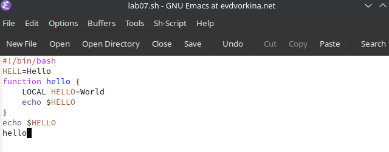{#fig:003 width=70%}

Сохраняю файл с помощью комбинации C-x C-s (рис. @fig:004).

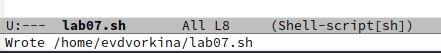{#fig:004 width=70%}

Вырезаю одной командой целую строку (С-k) (рис. @fig:005).

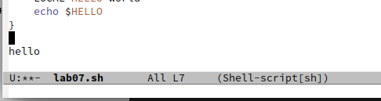{#fig:005 width=70%}

Вставляю эту строку в конец файла (C-y) (рис. @fig:006).

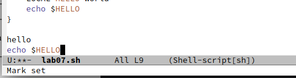{#fig:006 width=70%}

Выделяю область текста (C-space), копирую область в буфер обмена (M-w), вырезаю эту область с помощью C-w (рис. @fig:007).

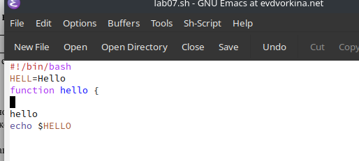{#fig:007 width=70%}

Вставляю область в конец файла (С-у)(рис. @fig:008).

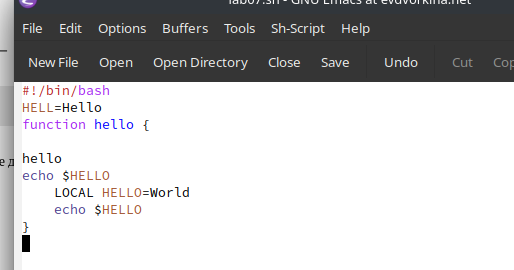{#fig:008 width=70%}

Отменяю последнее действие С-/ (рис. @fig:009).

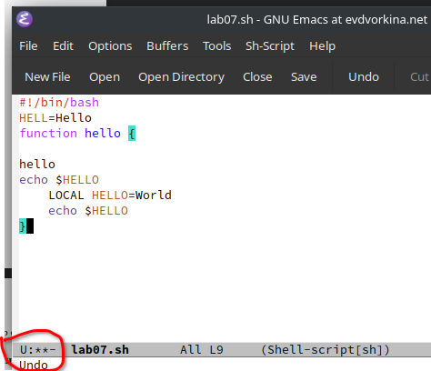{#fig:009 width=70%}

Перемещаю курсор в начало строки С-а (рис. @fig:010).

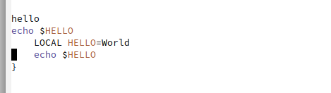{#fig:010 width=70%}

Перемещаю курсор в конец строки С-е (рис. @fig:011).

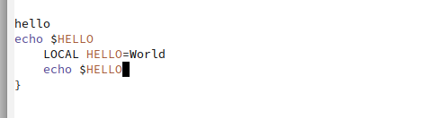{#fig:011 width=70%}

Перемещаю курсор в начало файла М-< (рис. @fig:012).

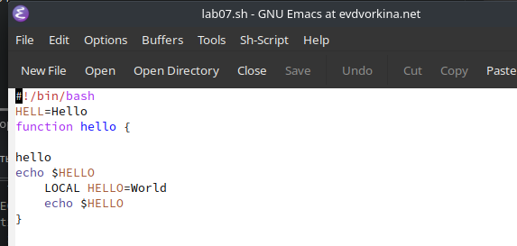{#fig:012 width=70%}

Перемещаю курсор в конец файла M->(рис. @fig:013).

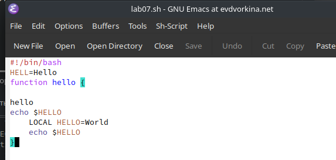{#fig:013 width=70%}

Открываю список активных буферов в другом окне C-x C-b (рис. @fig:014).

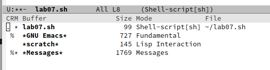{#fig:014 width=70%}

Переключаюсь на другой буфер C-x o (рис. @fig:015).

{#fig:015 width=70%}

Закрываю окно другого буфера C-x 0 (рис. @fig:016).

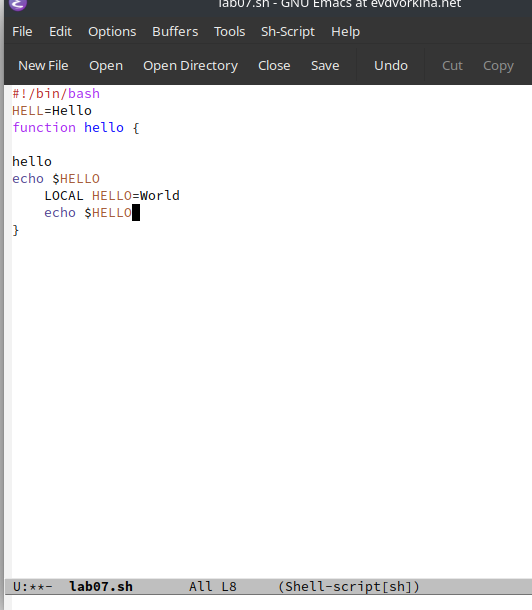{#fig:016 width=70%}

Открываю другой буфер без вывода их списка на экран с помощью C-x b (рис. @fig:017).

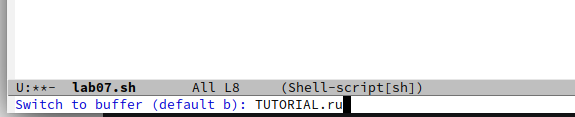{#fig:017 width=70%}

Делю фрейм на 4 части: сначала на два окна по вертикали (C-x 3),
а затем каждое из этих окон на две части по горизонтали (C-x 2) (рис. @fig:018).

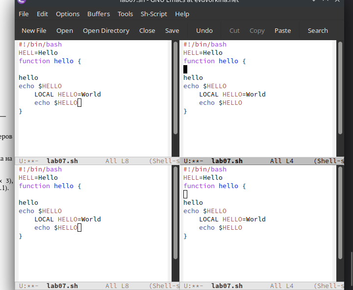{#fig:018 width=70%}

В каждом из четырех созданных окон с помощью C-x b открыла разные буферы и ввела
несколько строк текста (рис. @fig:019).

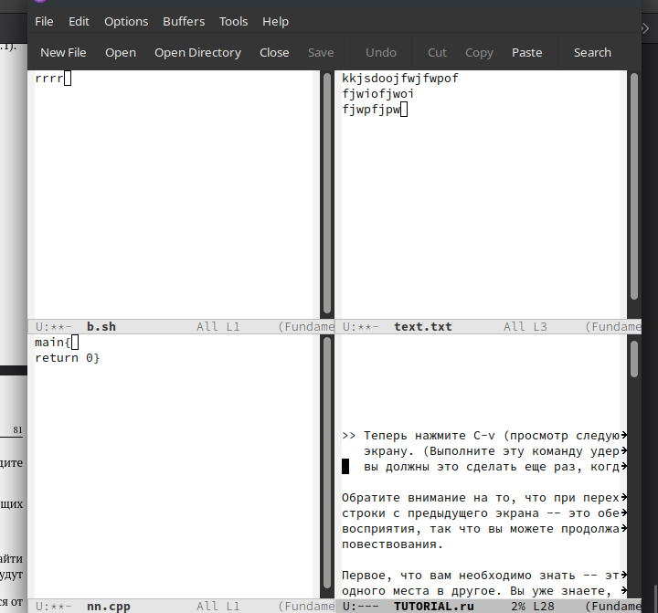{#fig:019 width=70%}

Перехожу в режим поиска с помощью C-s, ищу слова в тексте, они подсвечиваются (рис. @fig:020).

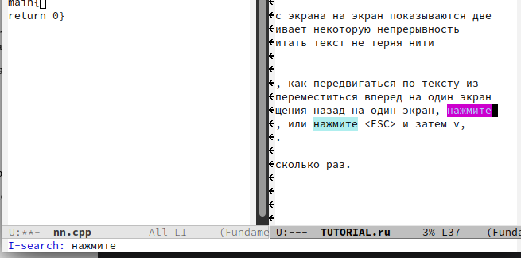{#fig:020 width=70%}

С помощью той же комбинации C-s я могу перемещаться по результатам поиска (рис. @fig:021).

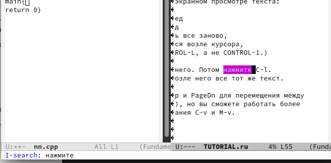{#fig:021 width=70%}

С помощью C-g выхожу из режима поиска, снимается выделение (рис. @fig:022).

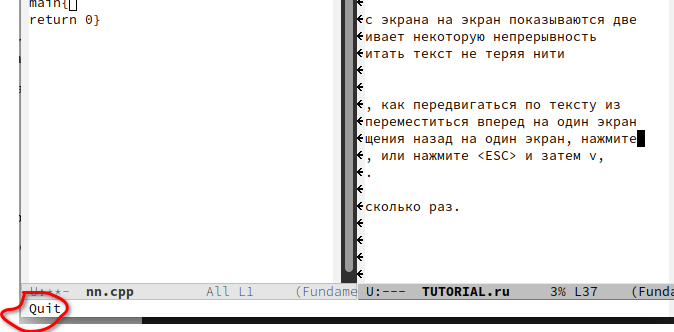{#fig:022 width=70%}

Перехожу в режим поиска и замены с помощью M-%, ввожу какое слово хочу заменить, затем ввожу на какое хочу заменить (рис. @fig:023).

{#fig:023 width=70%}

Видим, что слова были заменены успешно (рис. @fig:024).

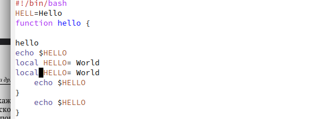{#fig:024 width=70%}

С помощью M+s перехожу в другой режим поиска. Он отличается от предыдущего тем, что выводит результат в отдельном окне от окна буфера (рис. @fig:025).

{#fig:025 width=70%}

# Выводы

В ходе данной лабораторной работы я познакомилась с операционной системой Linux и получила практические навыки работы с редактором Emacs.

# Список литературы{.unnumbered}

::: {#refs}
:::
