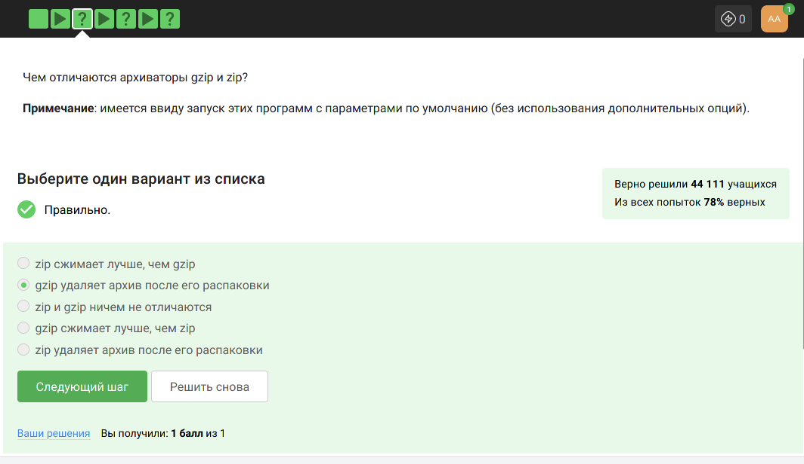
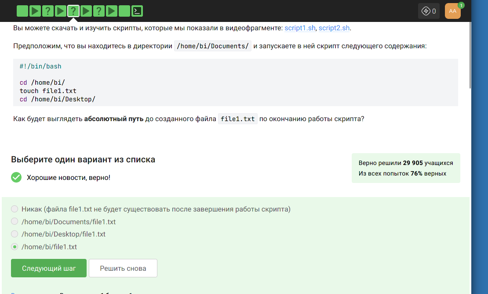

---
## Front matter
title: "Отчёт по прохождении внешнего курса на Stepik.Введение в Linux"
subtitle: "Операционные системы"
author: "Аветисян Алина Эдуардовна"

## Generic otions
lang: ru-RU
toc-title: "Содержание"

## Bibliography
bibliography: bib/cite.bib
csl: pandoc/csl/gost-r-7-0-5-2008-numeric.csl

## Pdf output format
toc: true # Table of contents
toc-depth: 2
lof: true # List of figures
lot: true # List of tables
fontsize: 12pt
linestretch: 1.5
papersize: a4
documentclass: scrreprt
## I18n polyglossia
polyglossia-lang:
  name: russian
  options:
	- spelling=modern
	- babelshorthands=true
polyglossia-otherlangs:
  name: english
## I18n babel
babel-lang: russian
babel-otherlangs: english
## Fonts
mainfont: PT Serif
romanfont: PT Serif
sansfont: PT Sans
monofont: PT Mono
mainfontoptions: Ligatures=TeX
romanfontoptions: Ligatures=TeX
sansfontoptions: Ligatures=TeX,Scale=MatchLowercase
monofontoptions: Scale=MatchLowercase,Scale=0.9
## Biblatex
biblatex: true
biblio-style: "gost-numeric"
biblatexoptions:
  - parentracker=true
  - backend=biber
  - hyperref=auto
  - language=auto
  - autolang=other*
  - citestyle=gost-numeric
## Pandoc-crossref LaTeX customization
figureTitle: "Рис."
tableTitle: "Таблица"
listingTitle: "Листинг"
lofTitle: "Список иллюстраций"
lotTitle: "Список таблиц"
lolTitle: "Листинги"
## Misc options
indent: true
header-includes:
  - \usepackage{indentfirst}
  - \usepackage{float} # keep figures where there are in the text
  - \floatplacement{figure}{H} # keep figures where there are in the text
---

# Цель работы

Пройдя внешний курс научиться пользоваться интерфейсом и основным командам на Linux, и
получить сертификат о прохождении курса.

# Задание

1. Пройти Раздел 1: Введение.
2. Пройти Раздел 2: Работа на сервере.
3. Пройти Раздел 3: Продвинутые темы.
4. Получить сертификат.

# Выполнение лабораторной работы

Начинаем решать раздел 1.

{#fig:001 width=70%}

{#fig:002 width=70%}

{#fig:003 width=70%}

{#fig:004 width=70%}

{#fig:005 width=70%}

{#fig:006 width=70%}

{#fig:007 width=70%}

{#fig:008 width=70%}

{#fig:009 width=70%}

{#fig:010 width=70%}

{#fig:011 width=70%}

{#fig:012 width=70%}

{#fig:013 width=70%}

{#fig:014 width=70%}

{#fig:015 width=70%}

{#fig:016 width=70%}

Скачав файл с программой, сделала его исполняемым, запустила и скопировала то, что он выведет на экран, в форму ниже.

{#fig:017 width=70%}

{#fig:018 width=70%}

{#fig:019 width=70%}

{#fig:020 width=70%}

{#fig:021 width=70%}

Для ответа на этот вопрос мне понадобится справка по команде wget, которую легко можно получить, набрав man wget .

{#fig:022 width=70%}

{#fig:023 width=70%}

{#fig:024 width=70%}

{#fig:025 width=70%}

{#fig:026 width=70%}

{#fig:027 width=70%}

{#fig:028 width=70%}

{#fig:029 width=70%}

Ответ, написанный в форме ниже задания:

Whom whilst I laboured of a love to see,
LUCIANA. Ere I learn love, I'll practise to obey.
Would that alone a love he would detain,
As you love strokes, so jest with me again.
Your sauciness will jest upon my love,
For know, my love, as easy mayst thou fall
Even in the spring of love, thy love-springs rot?
Shall love, in building, grow so ruinous?
Muffle your false love with some show of blindness;
Being compact of credit, that you love us;
ANTIPHOLUS OF SYRACUSE. As good to wink, sweet love, as look on night.
LUCIANA. Why call you me love? Call my sister so.
Thee will I love, and with thee lead my life;
Belike you thought our love would last too long,
LUCIANA. That love I begg'd for you he begg'd of me.
ADRIANA. With what persuasion did he tempt thy love?
Stray'd his affection in unlawful love?
Namely, some love that drew him oft from home.
CLEOPATRA. If it be love indeed, tell me how much.
ANTONY. There's beggary in the love that can be reckon'd.
ANTONY. How, my love?
Why did he marry Fulvia, and not love her?
Now for the love of Love and her soft hours,
SOOTHSAYER. You shall be more beloving than beloved.
CHARMIAN. O, excellent! I love long life better than figs.
finest part of pure love. We cannot call her winds and waters
Whose love is never link'd to the deserver
CHARMIAN. Madam, methinks, if you did love him dearly,
Are newly grown to love. The condemn'd Pompey,
CLEOPATRA. O most false love!
So Antony loves.
And give true evidence to his love, which stands
And the ebb'd man, ne'er lov'd till ne'er worth love,
Ever love Caesar so?
The people love me, and the sea is mine;
Of both is flatter'd; but he neither loves,
Looking for Antony. But all the charms of love,
ENOBARBUS. Or, if you borrow one another's love for the instant,
Where now half tales be truths. Her love to both
Would each to other, and all loves to both,
The heart of brothers govern in our loves
Did ever love so dearly. Let her live
Fly off our loves again!
The winds were love-sick with them; the oars were silver,
Of us that trade in love.
than the love of the parties.
ENOBARBUS. A very fine one. O, how he loves Caesar!
ENOBARBUS. But he loves Caesar best. Yet he loves Antony.
His love to Antony. But as for Caesar,
AGRIPPA. Both he loves.
Betwixt us as the cement of our love
ANTONY. The April's in her eyes. It is love's spring,
I'll wrestle with you in my strength of love.
Let your best love draw to that point which seeks
Can never be so equal that your love
The ostentation of our love, which left unshown
Of us and those that love you. Best of comfort,
Each heart in Rome does love and pity you;
As you did love, but as you fear'd him.
I'll make death love me; for I will contend
More tight at this than thou. Dispatch. O love,
To business that we love we rise betime,
CLEOPATRA. Why is my lord enrag'd against his love?
As to a lover's bed. Come, then; and, Eros,
ANTONY. Let him that loves me, strike me dead.
Than love that's hir'd! What, goest thou back? Thou shalt
Which my love makes religion to obey,
The stroke of death is as a lover's pinch,
As needful in our loves, fitting our duty?
And with no less nobility of love
Ham. For God's love let me hear!
I will requite your loves. So, fare you well.
Ham. Your loves, as mine to you. Farewell.
Grows wide withal. Perhaps he loves you now,
Whereof he is the head. Then if he says he loves you,
Oph. My lord, he hath importun'd me with love
If thou didst ever thy dear father love-
As meditation or the thoughts of love,
From me, whose love was of that dignity
With all my love I do commend me to you;
May do t' express his love and friending to you,
Pol. Mad for thy love?
This is the very ecstasy of love,
More grief to hide than hate to utter love.
But never doubt I love.
reckon my groans; but that I love thee best, O most best, believe
Receiv'd his love?
When I had seen this hot love on the wing
Or look'd upon this love with idle sight?
Mark the encounter. If he love her not,
for love- very near this. I'll speak to him again.- What do you
obligation of our ever-preserved love, and by what more dear a
Ham.Nay then, I have an eye of you.- If you love me, hold
target; the lover shall not sigh gratis; the humorous man shall
The which he loved passing well.'
love passing well.
If't be th' affliction of his love, or no,
The pangs of despis'd love, the law's delay,
but now the time gives it proof. I did love you once.
inoculate our old stock but we shall relish of it. I loved you
Sprung from neglected love.- How now, Ophelia?
his love.
Ham. As woman's love.
Since love our hearts, and Hymen did our hands,
Make us again count o'er ere love be done!
For women's fear and love holds quantity,
Now what my love is, proof hath made you know;
And as my love is siz'd, my fear is so.
Where love is great, the littlest doubts are fear;
Where little fears grow great, great love grows there.
King. Faith, I must leave thee, love, and shortly too;
Such love must needs be treason in my breast.
Are base respects of thrift, but none of love.
That even our loves should with our fortunes change;
Whether love lead fortune, or else fortune love.
And hitherto doth love on fortune tend,
Ham. I could interpret between you and your love, if I could see
shall see anon how the murtherer gets the love of Gonzago's wife.
Ros. My lord, you once did love me.
Guil. O my lord, if my duty be too bold, my love is too unmannerly.
From the fair forehead of an innocent love,
You cannot call it love; for at your age
Stew'd in corruption, honeying and making love
Would gambol from. Mother, for love of grace,
This mad young man. But so much was our love
And, England, if my love thou hold'st at aught,-
How should I your true-love know
With true-love showers.
Nature is fine in love, and where 'tis fine,
After the thing it loves.
Oph. There's rosemary, that's for remembrance. Pray you, love,
Is the great love the general gender bear him,
I lov'd your father, and we love ourself,
King. Not that I think you did not love your father;
But that I know love is begun by time,
There lives within the very flame of love
In youth when I did love, did love,
Could not (with all their quantity of love)
Queen. For love of God, forbear him!
As love between them like the palm might flourish,
Ham. Why, man, they did make love to this employment!
I do receive your offer'd love like love,
O that you were your self, but love you are
O none but unthrifts, dear my love you know,
And all in war with Time for love of you,
Thou art more lovely and more temperate:
O carve not with thy hours my love's fair brow,
My love shall in my verse ever live young.
Mine be thy love and thy love's use their treasure.
Of his self-love to stop posterity?
Calls back the lovely April of her prime,
Unthrifty loveliness why dost thou spend,
The lovely gaze where every eye doth dwell
No love toward others in that bosom sits
For shame deny that thou bear'st love to any
Grant if thou wilt, thou art beloved of many,
Shall hate be fairer lodged than gentle love?
Make thee another self for love of me,

Начинаем решать раздел 2.

{#fig:030 width=70%}

{#fig:031 width=70%}

{#fig:032 width=70%}

{#fig:033 width=70%}

{#fig:034 width=70%}

{#fig:035 width=70%}

{#fig:036 width=70%}

{#fig:037 width=70%}

{#fig:038 width=70%}

{#fig:039 width=70%}

{#fig:040 width=70%}

{#fig:041 width=70%}

{#fig:042 width=70%}

{#fig:043 width=70%}

{#fig:044 width=70%}

{#fig:045 width=70%}

{#fig:46 width=70%}

{#fig:47 width=70%}

{#fig:048 width=70%}

{#fig:049 width=70%}

Выполнив необходимые действия, получаю ответ.

{#fig:050 width=70%}

{#fig:051 width=70%}

{#fig:052 width=70%}

{#fig:053 width=70%}

{#fig:054 width=70%}

{#fig:055 width=70%}

{#fig:056 width=70%}

Самостоятельно изучаю tmux и отвечаю на задание.

{#fig:057 width=70%}

Начинаем решать раздел 3.

{#fig:058 width=70%}

{#fig:059 width=70%}

Посмотрела  справку по этим перемещениям и разобралась в чем заключается разница между word и WORD.

{#fig:060 width=70%}

{#fig:061 width=70%}

{#fig:062 width=70%}

{#fig:063 width=70%}

{#fig:064 width=70%}

{#fig:065 width=70%}

{#fig:066 width=70%}

{#fig:067 width=70%}

{#fig:068 width=70%}

Написала скрипт на bash.

{#fig:069 width=70%}

{#fig:070 width=70%}

{#fig:071 width=70%}

{#fig:072 width=70%}

{#fig:073 width=70%}

{#fig:074 width=70%}

Написала скрипт на bash.

{#fig:075 width=70%}

{#fig:076 width=70%}

{#fig:077 width=70%}

{#fig:078 width=70%}

{#fig:079 width=70%}

Написала скрипт на bash.

{#fig:080 width=70%}

{#fig:081 width=70%}

{#fig:082 width=70%}

{#fig:083 width=70%}

{#fig:084 width=70%}

{#fig:085 width=70%}

{#fig:086 width=70%}

{#fig:087 width=70%}

Написала скрипт на bash.

{#fig:088 width=70%}

{#fig:089 width=70%}

{#fig:090 width=70%}

Написала калькулятор на bash.

{#fig:091 width=70%}

{#fig:092 width=70%}

{#fig:093 width=70%}

{#fig:094 width=70%}

{#fig:095 width=70%}

{#fig:096 width=70%}

{#fig:097 width=70%}

{#fig:098 width=70%}

{#fig:099 width=70%}

Записала в форму ниже инструкцию sed, которая заменит все "аббревиатуры" в файле input.txt на слово "abbreviation" и запишет результат в файл edited.txt 

{#fig:100 width=70%}

{#fig:101 width=70%}

{#fig:102 width=70%}

{#fig:103 width=70%}

Вписала в форму ниже одну команду (т.е. одну строку), которую нужно добавить в скрипт, для выполнения задачи.

{#fig:104 width=70%}

{#fig:105 width=70%}

{#fig:106 width=70%}

{#fig:107 width=70%}

{#fig:108 width=70%}

{#fig:109 width=70%}

{#fig:110 width=70%}

{#fig:111 width=70%}

{#fig:112 width=70%}

В итоге по прохождении курса я получила сертификат.

{#fig:113 width=70%}

# Выводы
Я научилась пользоваться интерфейсом и изучила основные команды на Linux, также я получила сертификат о прохождении курса.

# Список литературы{.unnumbered}

::: {#refs}
:::
